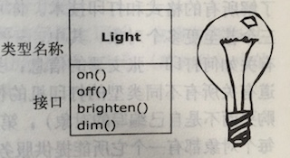
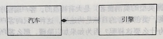
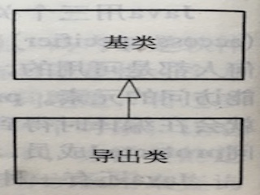
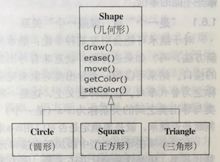
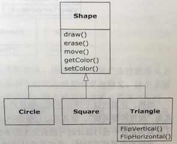
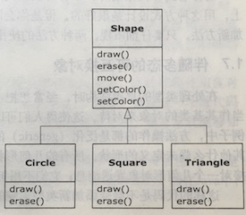
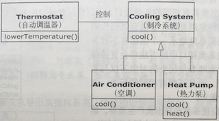
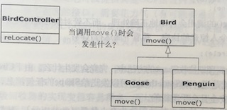
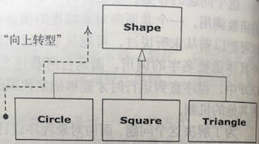

[TOC]

# 第1章 对象导论

OOP：Object-oriented Programming

## 1.1 抽象过程

1. 万物皆为对象
2. 程序是对象的集合，它们通过发送消息来告知彼此所需要做的
3. 每个对象都有自己的由其他对象所构成的存储
4. 每个对象都拥有其类型
5. 某一特定类型的所有对象都可以接收同样的消息

## 1.2 每个对象都有一个接口



每个对象只能满足某些请求，这些请求由对象的接口(interface)所定义，决定接口的便是类型。

UML，类名在顶部、关心的数据成员在中部、方法在底部

## 1.3 每个对象都提供服务

将对象想象为“服务提供者”

打印例子，一个对象处理不同的发票排版，另一个对象处理不同的打印机，第三个调用前两个实现打印

## 1.4 被隐藏的具体实现

类创建者—客户端程序猿 === API提供者---API使用者

访问控制原因：不让使用者触及某些资源；修改内部实现时不影响使用者；

* public(任何人可用)
* private(仅类型创建者和类型的内部方法可以访问)
* protected(比private多了个继承的类可以访问)
* 包访问权限(不加修饰词时默认权限)

## 1.5 复用具体实现

最简单的复用某个类的方式就是直接使用该类的一个对象，此外也可以将那个类的一个对象置于某个新的类中。称其为“创建一个成员对象”。

组合(composition使用现有的类合成新的类),聚合(aggregation动态发生的组合)

has-a(汽车has-a引擎)，实心菱形表示组合，没有菱形的线表示关联



组合创建的新类的成员对象通常都被声明为private，不干扰使用者，方便动态修改

继承创建的新类不灵活，编译器需要对其施加编译时的限制

## 1.6 继承

实现和一个类相似的类，复制它，添加和修改副本来创建新类

当源类(基类、超类或父类)发生变动时，被修改的副本(导出类、继承类或子类)也会反映出变动





导出类包含基类所有成员(包含private成员)，且复制了基类的接口

通过发送给类的消息的类型可知类的类型=>导出类与基类由相同的类型





使基类和导出类产生差异的方法：添加方法、覆盖(overriding 改变基类的方法)

### 1.6.1 “是一个”与“像是一个”关系

* 继承只覆盖基类的方法，不添加新的方法 => 替代原则

  is-a判断是否是继承。一个圆 is-a 几何形状

* is-like-a 一个既能制冷又能制热的热力泵is-like-a空调

## 1.7 伴随多态的可互换对象

在“几何形”的例子中，方法操作的都是泛化(generic)的几何形，不关心操作的是圆形、三角形。



BirdController调用泛型的move方法，前期绑定(非OOP编译时需要明确Goose的move方法地址)，后期绑定(OOP中直到运行时才确定Goose的move方法地址)

```Java
void doSth(Shape shape) {
    shape.erase();
    shape.draw();
}

Circle circle = new Circle();
Triangle triangle = new Triangle();
doSth(circle);
doSth(triangle);
```

向上转型(upcasting) 

多态：泛型有多种形态或者说泛型的draw方法有多种形态

## 1.8 单根继承结构

所有的类都继承自单一的基类Object

## 1.9 容器

解决某个问题不知道需要多少个对象，容器可以在需要时扩充自己容纳对象

Java具有满足不同需要的各种类型的容器：List(存储序列)、Map(关联数组，用来建立对象之间的关联)、Set(每种对象类型只持有一个)以及诸如队列、树、堆栈等更多的构件。

### 1.9.1 参数化类型

Java SE5之前，容器中存储的对象都是Object，从容器中取出对象后需要向下转型到具体的类型。

之后出现参数化类型，Java称之为范型

```Java
ArrayList<Shape> shapes = new ArrayList<Shape>();
```

## 1.10 对象的创建和生命期


# 第2章 一切都是对象


